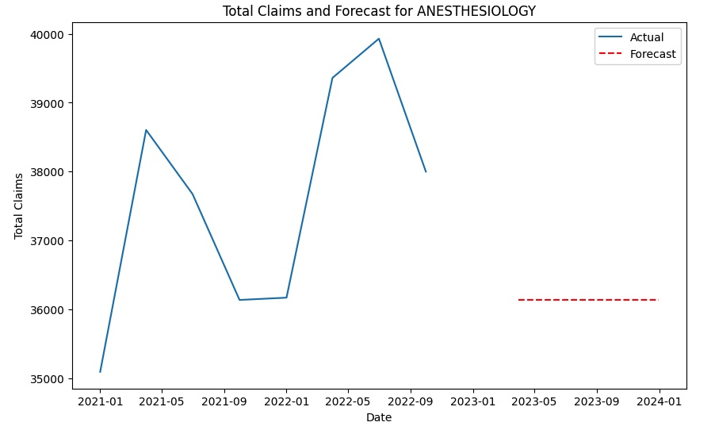
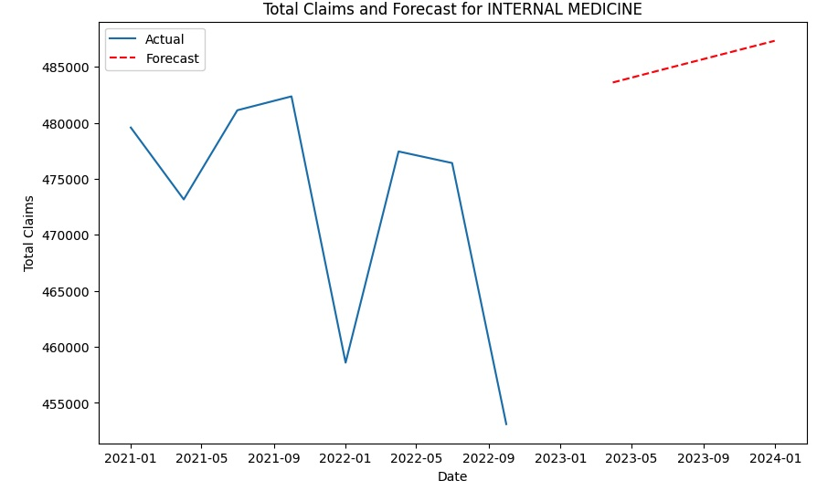
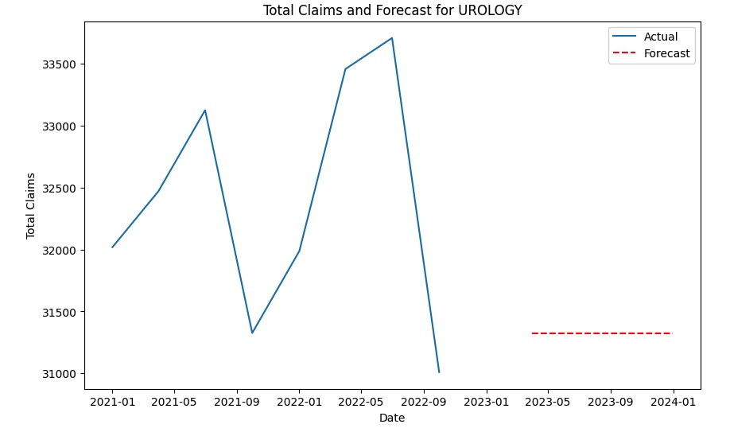

# Title Page
- **Optimizing Clinical Staffing in Cleveland Healthcare: Demand Analysis and Projections for Internal Medicine, Urology, and Anesthesiology (2021-2022)**
- **Ben Bubnick**
- **2023-12-13**
- **Axuall**

## Executive Summary
- A brief overview of the report, including key findings and recommendations.

## Problem Framing: Healthcare Staffing Efficiency in Cleveland

### Problem Definition
- **Issue:** Lack of accurate data on local demand for healthcare services in Cleveland, affecting healthcare facilities.
- **Consequences:** 
  - Inefficient staffing decisions across departments like Internal Medicine, Urology, and Anesthesiology.
  - Potential resource wastage (over-staffing) or lost revenue and compromised patient care (under-staffing).

### Business Impact
- **Financial Efficiency:** Proper staffing enhances resource utilization and revenue.
- **Quality of Healthcare:** Direct link to staffing ratios.
- **Employee Well-being:** Affects clinician job satisfaction and burnout.
- **Reputation and Compliance:** Impacts facility trust and regulatory adherence.

### Task Objectives
1. **Expansion Needs:** Determine which specialties require more clinicians in 2023.
2. **Staffing Reductions:** Identify specialties where staffing can be reduced.
3. **Clinician Utilization:** Evaluate if any clinician groups are over or under-utilized.

Hospital staff today are facing significant challenges due to data fragmentation, optimization issues, and complex technology integrations. These factors are contributing to clinician staff burnout, exacerbated by staffing shortages and continued worker fatigue following the COVID-19 pandemic.

According to an Intelligent Medical Objects (IMO) report, 65% of healthcare leaders recognize clinical staff burnout as a major issue, with 45% identifying frustrating data issues within their organizations. Although healthcare AI has been touted as a solution to reduce data and software fatigue, its adoption faces hurdles.  Despite skepticism about AI's hype, 86% of respondents in the IMO report are using AI, mostly valuing its potential in administrative and clinical quality improvements. Over 90% of healthcare leaders plan to invest in software to mitigate clinician burnout, with investments focused on workflow optimization tools and data enablement software.

Healthcare facilities face challenges in accurately assessing local demand for key services. This data deficiency leads to inefficient workforce planning, resulting in potential over-staffing or under-staffing across various departments. The task is to analyze market trends in Internal Medicine, Urology, and Anesthesiology from 2021-2022 to determine the most critical specialties for expansion and those that can be scaled back in 2023, as well as to identify any instances of over- or under-utilization of clinician cohorts compared to their peers.

"Majority of healthcare leaders struggle with inefficient data, report finds." Healthcare Dive. Published March 23, 2023. Accessed December 13, 2023. [https://www.healthcaredive.com/news/majority-of-healthcare-leaders-struggle-with-inefficient-data-report-intelligent-medical-objects/645850/](https://www.healthcaredive.com/news/majority-of-healthcare-leaders-struggle-with-inefficient-data-report-intelligent-medical-objects/645850/).

## Table of Contents (XXXXXXX)
- List all the sections and sub-sections with page numbers for easy navigation.

## Introduction (XXXXXXX
- **Background:** Provide context for your analysis.
- **Objectives:** State the objectives of your analysis.
- **Methodology Overview:** Summarize the approach and tools used.

## Data Overview
- **Facilities:** Contains facility information classifications.
- **Provider-Facility Affiliated Cl:** Tracks claims activities for clinicians and facilities.
- **Provider Demographics:** Details provider's demographic and professional information.

After reviewing the data, I ensured that the data is well-organized and ready for analysis. First, I transformed the data into a more efficient format called Parquet files, as working with the raw data in Excel was slow on my older computer. You can find the details of this transformation in the `scripts/format_data.ipynb` notebook.

Next, I'm taking those transformed files and making sure they're consistent and reliable. Once this step is complete, I'll save the improved data in a folder called `data/processed`.

Another aspect of my work involves looking at the uniqueness of the information in our data rows. I conducted a basic data quality check on the original Excel data, documented in the `scripts/case_study_dqr.ipynb` notebook. This current notebook addresses any questions that arose from that initial assessment.

Fortunately, thanks to the efforts of Axuall, the data is of good quality. My main tasks involve applying standardized names to our tables and columns for clarity, as well as adding a unique identifier to the claims counts table for potential future use.

## Methodology
1. Data quality report: Quality check using basic statistics to ensure data integrity and ID performance issues.
2. File formatting: Transitioning raw data to Parquet files to improve data loading speeds.
3. Standardization: Applying naming conventions and analysis to ensure data uniqueness and integrity.
4. Descriptive analysis: Looking for trends and patterns in the data for choosing a predictive model.
5. Predictive analysis: Applying ARIMA models to forecast healthcare claims in specific specialties.

### Analysis Project Methodology Report

This report outlines the methodology adopted for a comprehensive analysis project focusing on healthcare claims data. The project's objective is to ensure data integrity, enhance data processing efficiency, and apply predictive modeling to forecast healthcare claims.

#### 1. Data Quality Report
- **Objective:** To establish a foundation of reliable data for analysis.
- **Methodology:**
  - Conducted quality checks on the raw data using basic statistical methods.
  - Identified and addressed performance issues, ensuring the data's completeness and accuracy.
  - Checked for anomalies, missing values, and outliers to assess data integrity.

#### 2. File Formatting
- **Objective:** To optimize data processing and loading times.
- **Methodology:**
  - Converted raw data from Excel format to Parquet files.
  - Chose Parquet for its efficiency in handling large datasets and its ability to maintain data schema and types.

#### 3. Standardization
- **Objective:** To streamline data for analysis and comparison.
- **Methodology:**
  - Applied standard naming conventions across all datasets to ensure consistency.
  - Conducted an in-depth analysis to guarantee the uniqueness and integrity of the data.
  - This process involved renaming columns, standardizing formats, and adding unique identifiers where necessary.

#### 4. Descriptive Analysis
- **Objective:** To understand underlying trends and patterns for model selection.
- **Methodology:**
  - Performed exploratory data analysis (EDA) to identify trends, patterns, and correlations in the data.
  - Analyzed historical data trends in healthcare claims across different specialties.
  - This phase informed the selection of an appropriate predictive model by identifying data characteristics.

#### 5. Predictive Analysis
- **Objective:** To forecast future healthcare claims in specific specialties.
- **Methodology:**
  - Selected the ARIMA model due to its effectiveness in handling non-seasonal time series data.
  - The model was tailored to the specific characteristics of the data, focusing on trend-based predictions.
  - Conducted model training, testing, and validation to ensure accuracy and reliability.
  - Generated forecasts for future claims, providing valuable insights for healthcare planning and resource allocation.

The methodology employed in this project ensures a thorough and reliable analysis of healthcare claims data. By meticulously preparing the data, ensuring its quality, and applying a suitable predictive model, the project provides actionable insights into future healthcare demands. This holistic approach is crucial for informed decision-making and strategic planning in healthcare services.

## Analysis and Findings

ARIMA time series of total claims for Anesthesiology, contrasting actual historical data with forecasts for the year 2023. 

The forecast, represented by the dashed red line, predicts a constant number of claims (36,136) for each quarter of 2023, suggesting no expected change in the volume of claims for Anesthesiology services in the upcoming year. This flat forecast contrasts with the historical volatility and may indicate an anticipation of stable demand or an averaging effect of the ARIMA modeling process.

ARIMA time series data for total claims in the field of Internal Medicine, contrasting actual historical data with an ARIMA model's forecasts for 2023. 

The graph suggests that the number of claims is expected to rise gradually each quarter, starting from approximately 483,600 claims at the beginning of 2023 and reaching around 487,320 by the fourth quarter. This ascending trend in the forecast could imply an anticipated growth in demand for Internal Medicine services. 

ARIMA time series analysis for Urology, showing actual historical total claims data alongside forecasted claims for the year 2023. 

The forecasted data, shown as a dashed red line, indicates a flat level of claims (31,326) for each quarter of 2023.

This suggests that the ARIMA model used for the forecast predicts a consistent number of claims for Urology throughout 2023, maintaining the same level as the end of 2022, without any expected increase or decrease. The model's output reflects no anticipated change in the claims trend for the coming year, implying a stable demand for Urology services. 

## Error Analysis and Recommendations for Healthcare Specialties

### 1. Internal Medicine
- **Metrics:**
  - MSE (Mean Squared Error): `486,194,852.25`
  - RMSE (Root Mean Squared Error): `22,049.83`
  - MAE (Mean Absolute Error): `19,074.75`
  - MAPE (Mean Absolute Percentage Error): `4.15%`

- **Interpretation:**
  - High RMSE and MAE values indicate notable variability in predictions.
  - MAPE of 4.15% suggests an average prediction error of about 4.15%.
  - Consistent upward trend in forecast indicates growing demand.

- **Implication for Recommendation:**
  - Increase in demand is evident, but high error values advise caution. 
  - Predictions should be supplemented with other market factors and historical data.

### 2. Anesthesiology
- **Metrics:**
  - MSE: `7,065,117.5`
  - RMSE: `2,658.03`
  - MAE: `2,228.5`
  - MAPE: `5.67%`

- **Interpretation:**
  - Lower MSE and RMSE than Internal Medicine, indicating better accuracy.
  - MAPE of 5.67% is moderately acceptable but indicates some prediction error.
  - Forecast shows stable demand for 2023.

- **Implication for Recommendation:**
  - Stability in demand suggests maintaining current staffing rather than reducing.
  - Decent level of confidence in these predictions based on error metrics.

### 3. Urology
- **Metrics:**
  - MSE: `2,690,553.25`
  - RMSE: `1,640.29`
  - MAE: `1,373.25`
  - MAPE: `4.13%`

- **Interpretation:**
  - Lowest RMSE and MAE among the three, indicating highest accuracy.
  - MAPE of 4.13% shows a reasonable level of accuracy.
  - Forecast suggests stable demand.

- **Implication for Recommendation:**
  - Stable demand does not strongly support a reduction.
  - Good level of confidence in this forecast.

## Discussion

The ARIMA model forecasts for Anesthesiology, Internal Medicine, and Urology reveal distinct trends that bear (statistically) significant implications for healthcare planning:

- **Internal Medicine**: In contrast to the other specialties, the Internal Medicine forecast shows a slight but steady increase in claims, implying expected growth in demand. Such a trend necessitates a proactive approach in resource planning to accommodate the anticipated higher volume of patients. The differing patterns across specialties underscore the need for tailored approaches to workforce planning. The stability in Anesthesiology and Urology claims forecasts provides a clear direction for consistent resource allocation. However, the increasing trend in Internal Medicine claims forecasts suggests a need for gradual expansion in this area. It's important to note, however, that the higher error metrics here suggest that while the trend is upward, there is a degree of uncertainty in the predictions.  Further analysis and model tuning would be needed before making a recommendation to a resource planning team.

## Addressing Surprising Findings

The consistency in Anesthesiology and Urology forecasts is somewhat unexpected, considering the inherent variability in healthcare demands. This is likely due to the averaging nature of ARIMA models, which may smooth out short-term fluctuations.  Furthermore, I could not definitively determine any seasonality in the data even though it `looks` season. Human perception is quite adept at seeing patterns even when they are note really there. Accurate descriptive analysis is therefore crucial. Additional data may yield a seasonal component. Qualitative analysis of other specialties however did not `look` seasonal. In either case, this aspect of the model's output warrants a closer look to ensure that it aligns with real-world expectations and to prepare for potential variations that the model may not fully capture.

## Recommendations

### Anesthesiology/Urology:
The forecast suggests a stable number of claims throughout 2023, indicating that the current level of resources may be adequate to meet demand. However, it's important to maintain flexibility to scale up resources quickly should an unexpected increase in demand occur. Given the model's moderate level of confidence:

- Maintain current staffing levels, with provisions for temporary staff during peak periods.
- Monitor quarterly data closely to identify any emerging trends.

### Internal Medicine:
The predicted gradual increase in claims suggests a growing demand for Internal Medicine services. To prepare for this, the following steps should be considered:

- Incrementally increase staffing levels to meet the growing demand forecasted for 2023.
- Consider the recruitment and training of additional staff in anticipation of this demand.

### Overall Recommendation Consideration:
- Expansion of Internal Medicine is supported by upward trend, despite higher errors.
- For Anesthesiology and Urology, stable demand suggests maintaining current staffing.
- Statistical forecasts are valuable but should be complemented by other factors like healthcare policy changes, emerging technologies, and demographic shifts.

## Limitations and Future Work

This analysis, while providing valuable forecasts for healthcare demand, does have its limitations. One significant constraint is the short time frame (~three hours) devoted to the entire process, which restricts the depth of data exploration and model refinement. Additionally, the use of ARIMA models, though robust for many time series forecasting tasks, may not capture complex seasonal patterns or sudden changes in trends without extensive historical data. The timeframe also limits the possibility of incorporating a more extensive set of external variables that could impact the accuracy of the forecasts. As a result, the predictions should be interpreted with caution, and the models used in this analysis should be viewed as a preliminary step that requires further development and validation with more extensive data and analysis time.

### Future Analysis

#### Expand Data Collection:
- Gather more historical data across several years to capture a broader range of patterns and potential seasonality.
- Include additional variables that may impact demand, such as economic indicators (zip code), population health trends, or payor utilization.

#### Incorporate External Datasets:
- Integrate external healthcare datasets that include broader regional or national trends.
- Explore data from healthcare events, such as flu seasons or public health campaigns, which may introduce seasonal effects.

## Enhance Seasonality Detection:
- Collect more time series data to explicitly test for and model seasonality.

#### Refine ARIMA Model:
- Experiment with different configurations of the ARIMA model's parameters (p, d, q) to improve fit and forecasting accuracy.
- Test for stationarity and apply differencing as needed to stabilize the time series data.

#### Enhanced Cross-Validation:
- Implement rolling forecast origin or time series cross-validation techniques to assess the model's predictive performance over different time intervals.

#### Comparative Model Assessment:
- Evaluate alternative forecasting models, such as SARIMA for seasonal data or machine learning methods like Random Forest or Neural Networks, and compare their performance with the current ARIMA model.

## Conclusion

The ARIMA model forecasts for Anesthesiology, Internal Medicine, and Urology provide valuable insights for resource planning in Cleveland healthcare. Anesthesiology and Urology are projected to have stable demand, suggesting current staffing levels should suffice, while Internal Medicine shows a gradual increase, indicating a need for strategic resource expansion. These forecasts, coupled with the models' error metrics, emphasize cautious interpretation and the necessity for ongoing analysis. Limitations due to the brief analysis timeframe and the non-seasonal nature of the ARIMA model highlight areas for future data collection and model refinement to enhance the precision of demand projections for healthcare services.

## Appendices
- [Data Quality Report Script](https://github.com/bubnicbf/claims_case_study/blob/main/scripts/case_study_dqr.ipynb)
- [Parquet File Format Script](https://github.com/bubnicbf/claims_case_study/blob/main/scripts/format_data.ipynb)
- [Data Standardization Script](https://github.com/bubnicbf/claims_case_study/blob/main/scripts/data_stndz.ipynb)
- [Descriptive Analysis Script](https://github.com/bubnicbf/claims_case_study/blob/main/scripts/descriptive_analysis.ipynb)
- [Predictive Analysis Script](https://github.com/bubnicbf/claims_case_study/blob/main/scripts/predictive_analysis.ipynb)
